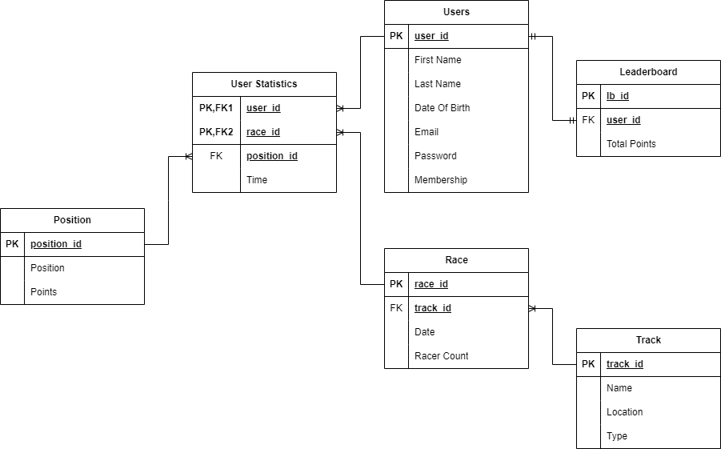

## Requirements

- [Node.js](https://nodejs.org/)
- [Yarn](https://yarnpkg.com/)

## Running The Project

Install all dependencies:

```bash
yarn install
```

Then, run the development server

```bash
yarn dev
```

Open [http://localhost:3000](http://localhost:3000) with your browser to view the site.

## Building The Project

To build the project, run:

```bash
yarn build
```

This will create a `build` directory with the compiled project.

## Running The Project In Production

To run the project in production, run:

```bash
yarn start
```

This will start the project in production mode.

View the site at [http://localhost:3000](http://localhost:3000).

## Development Notes

This project uses [Next.js](https://nextjs.org/) and [TypeScript](https://www.typescriptlang.org/). It also uses [Tailwind CSS](https://tailwindcss.com/) for styling.

The project is structured as follows:

- `app/`: Contains the main application code.
  - `api/`: Contains API routes.
  - `components/`: Contains Project Components.
    - `auth/`: Contains authentication components.
      - `[...nextauth]`: The authentication slug.
    - `forms/`: Contains form components.
    - `global/`: Contains global components.
      - `Header.tsx`: The header component.
      - `Footer.tsx`: The footer component.
    - `ui/`: Contains UI components.
  - `page.tsx`: The main page component.
  - `layout.tsx`: The layout component.
  - `contact/`: Contains the contact page components.
    - `page.tsx`: The contact page component.
  - `about/`: Contains the about page components.
    - `page.tsx`: The about page component.
  - `admin/`: Contains the admin page components.
    - `page.tsx`: The admin page component.
    - `layout.tsx`: The admin layout component.
  - `leaderboard/`: Contains the leaderboard page components.
    - `page.tsx`: The leaderboard page component.
  - `lib/`: Contains utility functions.
  - `bukc/`: Contains the bukc page components.
    - `page.tsx`: The bukc page component.
  - `socials/`: Contains the socials page components.
  - `utils/`: Contains utility functions.
    - `db/`: Contains database functions.
  - `page.tsx`: The socials page component.
  - `global.scss`: Global SCSS styles.
  - `favicon.ico`: The favicon.
- `public/`: Contains public assets.
  - `TeamSurreyKarting/` : Contains the logo(s) for the project.
  - `BUKC/` : Contains the BUKC logos.
  - `StudentUnion/` : Contains the Student Union logos.
  - `TeamSurrey/` : Contains the Team Surrey logos.
  - `UniOfSurrey/` : Contains the University of Surrey logos.
  - `images/` : Contains the images from BUKC races and social events.
    - `BUKC/` : Contains the images from BUKC races.
    - `Socials/` : Contains the images of social events.

The project uses [ESLint](https://eslint.org/).

### Colour Palette

- `#123047` - Nile Blue
- `#FCC133` - Lightning Gold

Each colour has a pallet variation of `50`, `100`, `200`, `300`, `400`, `500`, `600`, `700`, `800`, `900` and `950`.
The details can be found in the tailwind.config.js file.

### Entity Relationship Diagram For Leaderboard and Users



### Database Schema

Users Table

| Field Name    | Data Type | Constraints                               |
|---------------|-----------|-------------------------------------------|
| user_id       | INTEGER   | PRIMARY KEY                               |
| FirstName     | VARCHAR   | NOT NULL, 255                             |
| LastName      | VARCHAR   | 255                                       |
| Date Of Birth | DATE      | CAN BE NULL                               |
| Email         | VARCHAR   | NOT NULL, 255                             |
| Password      | VARCHAR   | NOT NULL, 255                             |
| Membership    | VARCHAR   | Must be either 'Professional' or 'Social' |

Leaderboard Table

| Field Name   | Data Type | Constraints |
|--------------|-----------|-------------|
| lb_id        | INTEGER   | PRIMARY KEY |
| user_id      | INTEGER   | FOREIGN KEY |
| Total Points | INTEGER   | CAN BE NULL |

User Statistics Table

| Field Name  | Data Type | Constraints              |
|-------------|-----------|--------------------------|
| user_id     | INTEGER   | PRIMARY KEY, FOREIGN KEY |
| race_id     | INTEGER   | PRIMARY KEY, FOREIGN KEY |
| position_id | INTEGER   | FOREIGN KEY              |
| Time        | TIME      | CAN BE NULL              |

Position Table

| Field Name  | Data Type | Constraints |
|-------------|-----------|-------------|
| position_id | INTEGER   | PRIMARY KEY |
| position    | INTEGER   | NOT NULL    |
| points      | INTEGER   | NOT NULL    |


Race Table

| Field Name  | Data Type | Constraints |
|-------------|-----------|-------------|
| race_id     | INTEGER   | PRIMARY KEY |
| track_id    | INTEGER   | FOREIGN KEY |
| race_date   | DATE      | NOT NULL    |
| racer_count | INTEGER   | NOT NULL    |

Track Table

| Field Name     | Data Type | Constraints                          |
|----------------|-----------|--------------------------------------|
| track_id       | INTEGER   | PRIMARY KEY                          |
| track_name     | VARCHAR   | NOT NULL                             |
| track_location | VARCHAR   | NOT NULL                             |
| track_type     | VARCHAR   | Must be either 'INDOOR' or 'OUTDOOR' |

[Database Sql Script](db.sql)

## Todo
### Features

- [x] Responsive design
- [x] Announcements
- [x] About Page
- [x] Contact Page
- [x] Leaderboard Page
- [x] Admin Page

### Admin Page
All curd operations for the db (leaderboard, tracks, users etc..)

More features to be added as needed.